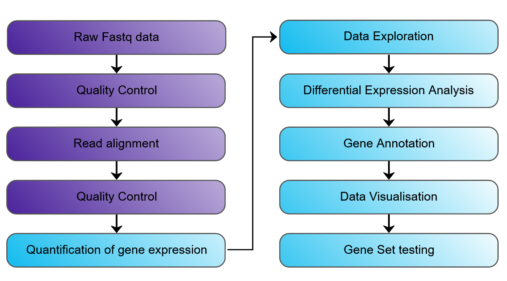
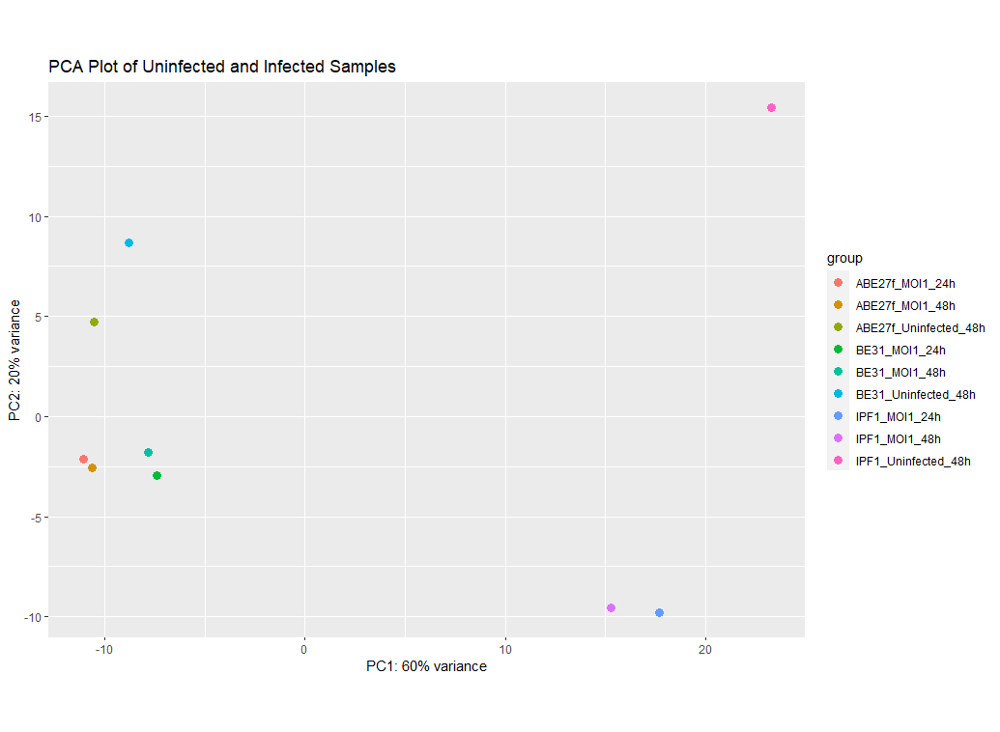
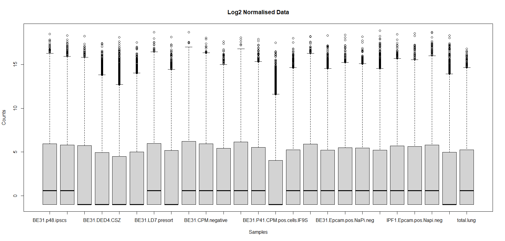
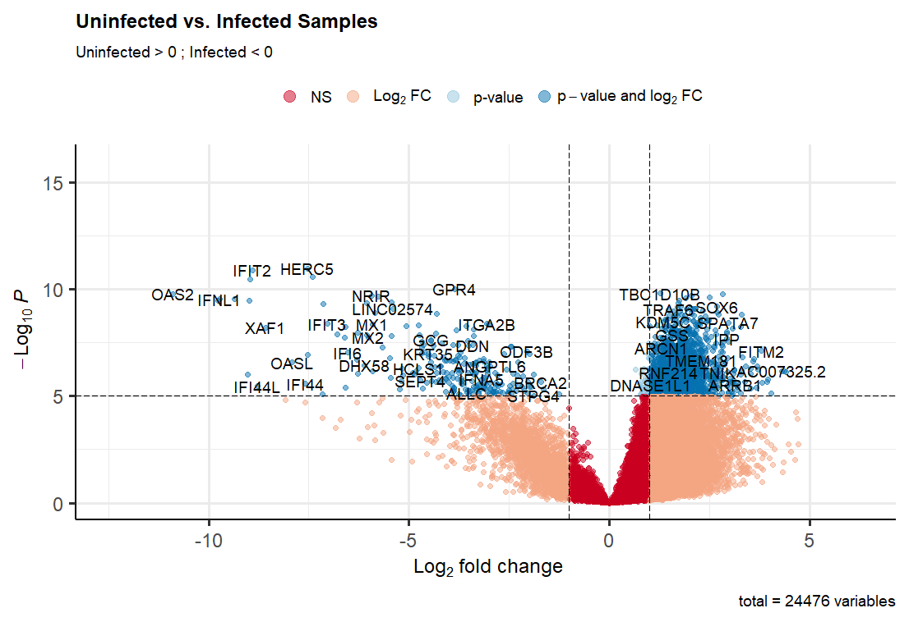
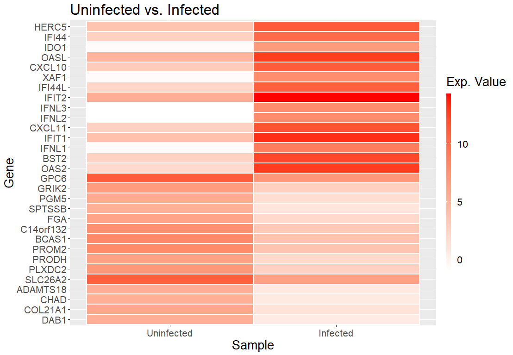

# Introduction
This file shows bulk RNA-seq data pipeline that we will possibly follow.

The pipeline that I've used for this example is from the course that was given last year, as I will be attending this course in a couple of weeks.

# Experimental Design

# Aligning to the Genome

# Quality Control

{width=110%}
{width=110%}

# Quantify Gene Expression (Staistical Analysis)

# Differential Gene Expression Analysis

{width=110%}
{width=110%}

# **Important Note**

Data visualisation and publication varies between publishers, field of interest, and personal preference.

For each analysis that is done, there needs to be a more in depth reading for bioinformatic analysis in the field to properly display the data for publication.

*This will obviously be discussed with each experiment, and it a continous discussion to find the best way to display the results.*

