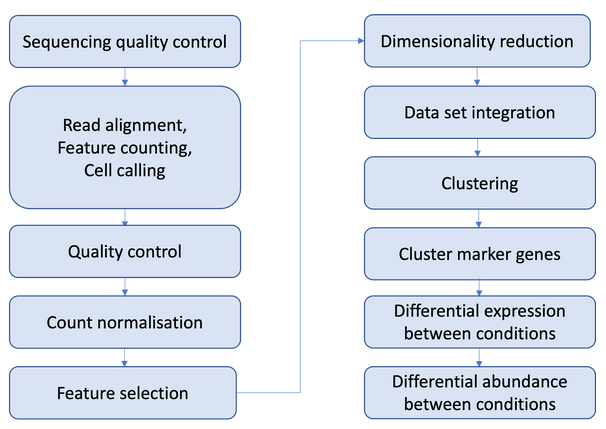

# Introduction
This file shows single cell RNA-seq data pipeline that we will possibly follow.

# Wet Lab Quality Control

# Read Alignment, Cell Calling and Feature Counting

# Quality Control

# Count normalisation

# Feature Selection

# Dimensionality Reduction

# Data Set Integration

# Clustering

# Cluster Marker Genes

# Differential Expression Between Conditions

# Differential Abundance Between Conditions

