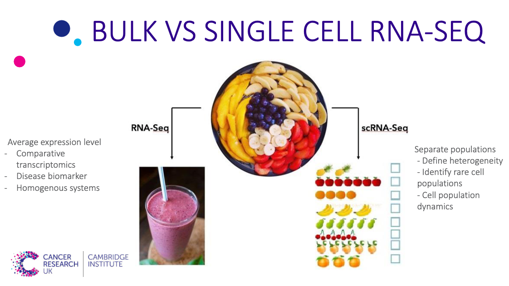

# What is R MarkDown?

***R MarkDown*** is a more efficient and detailed way for me to show you the bioinformatic analysis that has been done. This webpage allows me to display the pipeline that I followed for the analysis, allowing me to *explain*, *write code*, and *show the results* of the ongoing analysis.

# Spurious correlations

This is a template that can be used to further explain how a *R MarkDown* webpage works.

```{r}
"Here you can see some code that was written."
```
## Nicolas Cage Film Data


## Science vs. Suicides Data


<br>
<br>
<br>

# What have I been learning?

Using the training provided by the **University of Cambridge - Bioinformatics Team** and thanks to Nick's support. I've been able to attend some course and I will be attending more upcoming courses to help the lab improve the analysis of our bioinformatic data, as well as implement a system that will help all of us be on the same page of bioinformatics for different experiments.

Below you can see a list of the different courses that I've signed up for.


{width=80%}

### Reproducible Research in R - **ATTENDED**
This course provided me with a better insight as to how to **display** data for the lab, how to efficiently **store** the data, and potentially **publish** datasets.

One of the main things that it showed me is how to properly use this ***R MarkDown*** tool to show you data that has been analysed. I can link plots, images, papers, etc.

{width=25%}

Another tool that has been shared is ***Github***. This is a website that allows you to publish your data repositories and they can be public or private. My idea is to use this website for me to link all the scripts of code, plots, RMarkDown explanations, images, paper, etc. Into one same repository for us to have the same data available all the time. 

Hopefully by implementing this tool, we can improve the dialogue between the analysis and the biology for bioinformatics.

{width=50%}

### Core Statistics in R - **UPCOMING**
This is an upcoming course that I will take during July where I can go more in depth of the statistical analysis that is being done for RNA-seq data analysis.

### Analysis of Bulk and Single Cell RNA-Seq Data - **UPCOMING** & **ATTENDED**

These courses will help us improve the analysis of **Bulk RNA-Seq** & **Single Cell RNA-Seq**. One of the main ideas that I've gotten from this course is to properly understand your biological question and type of analysis you want to make before starting your experiment.




